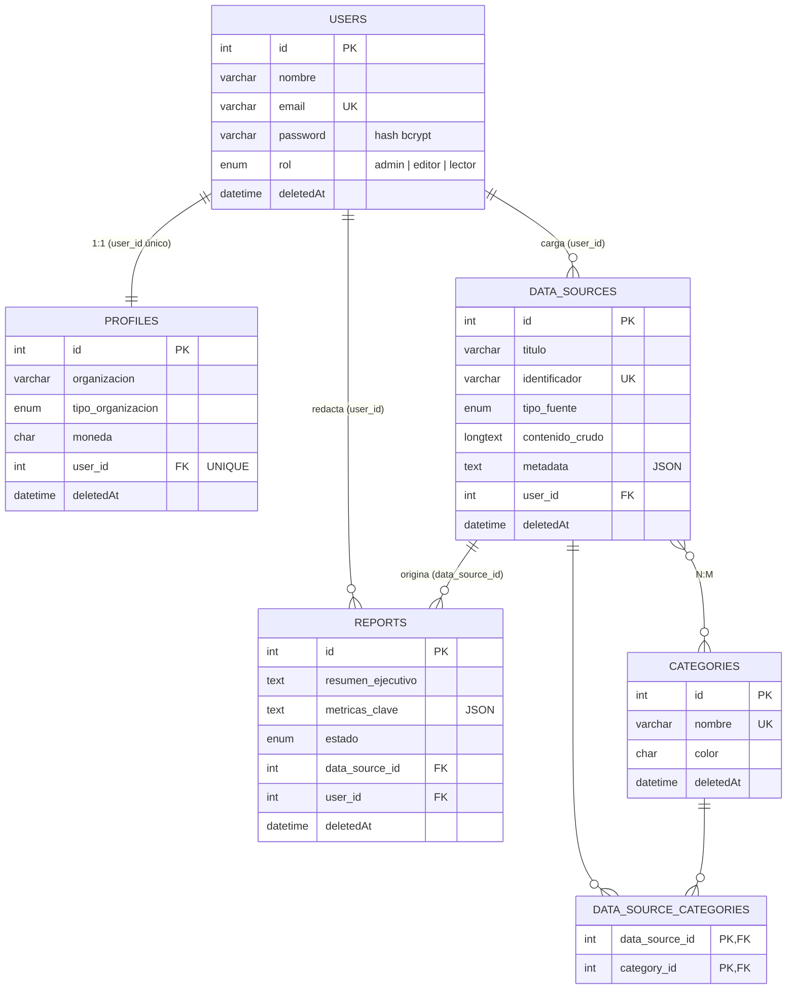

# Plan de implementación — InfoHub

Qué se hizo, con qué herramienta y **por qué**, en el orden en que se construyó (una etapa por rama de Git).

---

## 0. Del problema a la solución

| | |
|---|---|
| **Desafío** | Dificultad para transformar información dispersa en información útil. |
| **Situación** | Organizaciones, emprendimientos, instituciones y comunidades generan información en distintas fuentes y formatos. Fragmentada, desactualizada o difícil de comprender, no sirve para conocer la situación, detectar necesidades ni decidir con fundamento. |
| **A quién afecta** | *Quien decide* (presidentes de comisión, dueños de emprendimientos, referentes vecinales, directivos) no tiene una foto clara. *Quien carga* (voluntarios, empleados, socios) duplica trabajo anotando lo mismo en varios lugares. *Quien depende* (comunidad o clientela) sufre demoras, errores o falta de transparencia. |
| **Respuesta de InfoHub** | Cada problema de la consigna tiene una pieza concreta del sistema (tabla siguiente). |

| Problema de la consigna | Pieza de InfoHub que lo resuelve |
|---|---|
| Información **fragmentada** en distintas fuentes | Fuentes de datos centralizadas, clasificadas con categorías (N:M) |
| Información **desactualizada** | Tablero con alerta de fuentes sin actualizar hace más de 30 días |
| Información **difícil de comprender** | Analizador automático: métricas + resumen en lenguaje llano |
| **Duplicación** de trabajo | Identificador único por fuente; detección de registros duplicados |
| Decisiones **sin fundamento** | Reportes con métricas clave y estado (borrador / publicado / archivado) |
| Falta de **transparencia** | Rol lector: la comunidad consulta sin poder modificar |

---

## Fase 1 — Modelo de datos y flujo Git

### Diagrama entidad-relación



**Decisiones del modelo:**

| Decisión | Por qué |
|---|---|
| `identificador` en DataSource (ej. `CUOTAS-2026-09`) | La regla pide "no duplicar identificadores". Un código legible evita cargar dos veces la misma planilla y sirve para buscar. Se normaliza a mayúsculas. |
| `profiles.user_id` con índice UNIQUE | Garantiza el 1:1 **en la base**, no solo en el código. |
| `metadata` y `metricas_clave` como TEXT con getter/setter JSON | Funciona igual en MySQL y MariaDB (en MariaDB, `JSON` es un alias de LONGTEXT y mysql2 lo devolvería como string). El controlador siempre ve un objeto. |
| `contenido_crudo` LONGTEXT | Una planilla pegada puede superar los 64 KB de TEXT. |
| ENUM para `rol`, `tipo_fuente`, `estado` | Valores cerrados: la base rechaza cualquier otro. |
| Clave primaria compuesta en la pivote | Impide asociar dos veces la misma categoría a la misma fuente. |

### Flujo de ramas

```
main ──────────────────────────────────────────────────●  v1.0.0
  └─ develop ──●──────●──────●──────●──────●───────────┘
               │      │      │      │      │
   feature/env-config │      │      │      │
          feature/models-db  │      │      │
                 feature/endpoints-crud    │
                       feature/frontend-react
                                 feature/documentacion
```

```bash
git init -b main
git add README.md .gitignore && git commit -m "chore: inicializar repositorio con README y .gitignore"
git switch -c develop

git switch -c feature/env-config develop
#   ... commits ...
git switch develop
git merge --no-ff feature/env-config -m "merge: integrar feature/env-config en develop"
# Se repite con models-db, endpoints-crud, frontend-react y documentacion

git switch main
git merge --no-ff develop -m "release: versión 1.0.0 de InfoHub"
git tag -a v1.0.0 -m "Entrega hackathon"
```

**Por qué `--no-ff`:** fuerza un commit de merge aunque se pueda avanzar en línea recta. En `git log --graph` (o en GitHub → Network) cada feature queda como un bloque visible.

---

## Fase 2 — Backend

### 2.1 Configuración (`feature/env-config`)

| Archivo | Por qué así |
|---|---|
| `package.json` con `"type": "module"` | Activa `import`/`export`. Un `require()` falla: la regla se cumple por diseño. |
| `.env.example` | Documenta las variables (incluidas `JWT_SECRET` y `CORS_ORIGIN`) sin exponer valores reales. |
| `src/config/env.js` | Único lugar que lee `process.env`. Si cambia un nombre, se toca un archivo. |
| `src/config/db.js` | Una sola instancia de Sequelize compartida por todos los modelos (un pool de conexiones). |

### 2.2 Modelos y asociaciones (`feature/models-db`)

**Cada modelo define solo sus campos.** `Report.js` no importa `DataSource.js`. Si se importaran entre sí habría **dependencias circulares** (uno de los dos llega `undefined`). Por eso `models/index.js` importa todos y declara las relaciones:

```js
// 1:1
User.hasOne(Profile,  { foreignKey: { name: 'user_id', allowNull: false }, as: 'perfil' });
Profile.belongsTo(User, { foreignKey: { name: 'user_id', allowNull: false }, as: 'usuario' });

// 1:N
DataSource.hasMany(Report,  { foreignKey: { name: 'data_source_id', allowNull: false }, as: 'reportes' });
Report.belongsTo(DataSource, { foreignKey: { name: 'data_source_id', allowNull: false }, as: 'fuente' });

// N:M
DataSource.belongsToMany(Category, { through: DataSourceCategory, foreignKey: 'data_source_id', otherKey: 'category_id', as: 'categorias' });
Category.belongsToMany(DataSource, { through: DataSourceCategory, foreignKey: 'category_id', otherKey: 'data_source_id', as: 'fuentes' });
```

- **Bidireccionalidad:** cada relación se declara de los dos lados, así se puede consultar `reporte.fuente` y `fuente.reportes`.
- **FK explícita en snake_case:** sin esto Sequelize generaría `UserId`.
- **`allowNull: false` en la FK:** "todo reporte debe estar vinculado a una fuente" lo garantiza también la base.
- **`onDelete: 'RESTRICT'`:** como las bajas son lógicas nunca debería haber un `DELETE` físico; si alguien lo intenta desde SQL, la base lo frena.
- **Pivote como modelo propio** (`DataSourceCategory.js`): permite filtrar fuentes por categoría consultando directamente la pivote.

**Baja lógica:** con `paranoid: true`, `destroy()` ejecuta `UPDATE ... SET deletedAt = NOW()` y todas las consultas agregan `deletedAt IS NULL`. El historial de la organización nunca se pierde.

**Contraseñas (tres barreras):** hash con bcrypt en el hook `beforeSave` (solo si cambió), `defaultScope` que excluye `password` de todas las consultas, y `toJSON()` que la quita aunque esté cargada. Para el login se usa `User.scope('conPassword')` de forma explícita.

### 2.3 Endpoints (`feature/endpoints-crud`)

**Cadena de cada ruta:**

```js
router.post('/', puedeEditar, crearDataSourceRules, validateRequest, createDataSource);
//               ① rol        ② reglas               ③ ¿errores? → 400  ④ lógica
```

Antes de todo, `routes/index.js` aplica `verificarToken` a todo lo que no sea `/auth`.

**Autenticación y "usuario activo":** `verificarToken` valida el JWT y busca al usuario con `findByPk`. Como `User` es paranoid, **un usuario dado de baja no se encuentra** → 401. Así se cumple la regla "todo reporte debe estar vinculado a un usuario activo": el `user_id` del reporte sale de `req.user.id`, nunca del body.

**Validaciones — técnicas y motivo:**

| Técnica | Dónde | Por qué |
|---|---|---|
| `.custom(async)` con `paranoid: false` | email, identificador, nombre de categoría | Unicidad contra la base, incluyendo registros dados de baja (siguen ocupando el índice UNIQUE). |
| `.custom(fuenteExiste)` | `data_source_id` del reporte | Regla de negocio: fuente existente antes de llegar al controlador. |
| `.custom(categoriasExisten)` + `categorias.*` `.isInt()` | Alta/edición de fuente | Valida la lista completa de la N:M en una sola consulta. |
| `.optional()` | Todas las reglas de PUT | Actualización parcial. |
| `.toUpperCase()`, `.toLowerCase()`, `.toInt()` | identificador, email, ids | Sanitiza: `cuotas-2026-09` y `CUOTAS-2026-09` son el mismo identificador. |
| `.bail()` | Después de `notEmpty()` | No acumula mensajes sin sentido para un campo vacío. |

**`matchedData(req)`:** devuelve solo los campos con regla, ya sanitizados. Probado: `"rol":"admin"` en el registro y `"user_id":999` en una fuente se descartan. En los PUT se usa `matchedData(req, { locations: ['body'] })` para no mezclar el `id` de la URL.

**Códigos HTTP:**

| Código | Caso concreto |
|---|---|
| 200 | GET, PUT y DELETE exitosos |
| 201 | Registro, fuente, categoría o reporte creado |
| 400 | Regla de express-validator (incluye reglas de negocio), JSON mal formado, intentar quitarse el rol admin o darse de baja |
| 401 | Sin token, token vencido o usuario dado de baja |
| 403 | El rol no alcanza (lector que intenta crear; editor que edita a otro usuario) |
| 404 | `findByPk` devuelve `null` |
| 409 | PUT con identificador/email ya usado; eliminar una fuente con reportes activos |
| 500 | `catch` con `{ message, error }` |

**Transacciones:** el registro crea usuario + perfil juntos, las fuentes se crean junto con sus filas en la pivote, y la baja de un usuario da de baja también su perfil. O se completa todo, o no se guarda nada.

**Eager loading:** `include` con `attributes` mínimos y `through: { attributes: [] }` para no exponer la pivote. El listado de fuentes **no trae el contenido crudo** (puede pesar megas) y calcula `total_reportes` con una subconsulta en la misma query.

**Analizador (`utils/analizador.js`):** es la pieza que transforma lo disperso en útil. Detecta el separador (`,` `;` tab `|`) y lee números en formato argentino (`1.500,50`, `$ 2.000`). Calcula registros, columnas, % de completitud, duplicados, totales y promedios, valores más frecuentes y rango de fechas. Con eso redacta un resumen en lenguaje llano. Es una función pura: no toca la base, así que se puede probar sola.

**Tablero (`GET /api/dashboard`):** la "foto" de la organización en una sola llamada, con 7 consultas en paralelo (`Promise.all`). Devuelve totales, reportes por estado, fuentes sin reporte (`NOT EXISTS`) y fuentes sin actualizar hace más de 30 días.

---

## Fase 3 — Frontend React (`feature/frontend-react`)

| Archivo | Responsabilidad |
|---|---|
| `services/api.js` | **Único** lugar con `fetch`. Agrega el token, serializa JSON y convierte errores en `ApiError { status, errors }`. Si recibe 401 avisa a toda la app para cerrar sesión. |
| `context/AuthContext.jsx` | Sesión: login, registro, logout y recuperación del usuario al recargar. |
| `context/FeedbackContext.jsx` | Avisos flotantes y `confirmar()` que devuelve una Promise: `if (await confirmar('¿Eliminar?'))`. |
| `hooks/useForm.js` | Valores, errores y validación **en tiempo real**. `aplicarErroresServidor()` pone cada error de express-validator (`{ path, msg }`) bajo su campo. |
| `components/Field.jsx` | Etiqueta, control, ayuda y error en un componente: todos los formularios se ven y se comportan igual. |
| `components/Modal.jsx` | Modal controlado por estado de React (sin el JS de Bootstrap). Cierra con Esc o clic afuera. |
| `components/ReportModal.jsx` | Al elegir una fuente llama a `/analizar` y precarga métricas y resumen. La persona revisa, no arranca de cero. |
| `components/DataSourceModal.jsx` | Alta y edición de fuentes; carga de CSV/TXT desde la compu con `FileReader`; categorías como chips (N:M). |
| `pages/*` | Login, Tablero (dashboard de reportes), Fuentes (+ categorías), Perfil (1:1) y Usuarios (admin). |

**Decisiones:**
- **Validación en dos capas:** la del front da feedback inmediato y evita peticiones inútiles; la del back (express-validator) es la autoridad final. Los mensajes del servidor se muestran igual que los locales.
- **Rutas protegidas:** `Protegida` redirige a `/login` sin sesión y oculta Usuarios a quien no es admin. Los botones de edición no aparecen para el rol lector, y el backend igual lo impide (403).
- **Proxy de Vite** (`/api` → `:3000`) en desarrollo: sin problemas de CORS. En producción Express sirve `frontend/dist`, con el fallback de React Router.
- **Búsqueda con espera de 350 ms:** no se dispara una petición por cada tecla.
- **Estados:** spinner mientras carga, estado vacío con una acción sugerida y mensaje con "Reintentar" si no hay conexión.

**Diseño:** metáfora del **resaltador**. La interfaz es sobria (tinta índigo, fondo frío) y el amarillo aparece solo sobre las cifras que importan. La frase del tablero ("Tenés 3 fuentes cargadas y 1 reporte publicado. 2 fuentes todavía no se convirtieron en información útil") responde en un vistazo la pregunta de quien decide. Tipografía Public Sans (pensada para servicios públicos); IBM Plex Mono solo para identificadores y contenido crudo.

---

## Fase 4 — Pruebas

Colección completa y checklist en [`PRUEBAS_API.md`](PRUEBAS_API.md). Antes de la entrega todo se probó contra MariaDB: 30 casos de API (401, 403, 409, reglas de negocio, campos inyectados, N:M, bajas lógicas). También hubo una prueba de punta a punta en navegador: login fallido y correcto, alta de fuente con identificador duplicado (error bajo el campo), generación de reporte con métricas automáticas, 409 al eliminar una fuente con reportes, filtro de reportes, rol lector sin botones de edición y vista móvil.

---

## Herramientas utilizadas

| Herramienta | Uso |
|---|---|
| Node.js 18+ | Entorno con ES Modules nativos |
| Express 4 | Servidor, rutas, middlewares |
| Sequelize 6 + mysql2 | ORM: modelos, asociaciones 1:1/1:N/N:M, paranoid, transacciones |
| express-validator 7 | Reglas, sanitización, `matchedData` |
| jsonwebtoken | Sesión sin estado (JWT) |
| bcryptjs | Hash de contraseñas |
| dotenv · cors | Configuración por entorno · acceso desde el front en desarrollo |
| React 18 + Vite 5 | Interfaz por componentes y servidor de desarrollo rápido |
| React Router 6 | Navegación y rutas protegidas |
| Bootstrap 5 + Bootstrap Icons | Grilla, formularios y componentes base |
| Git (Gitflow) | Ramas por etapa, merges `--no-ff`, tag de versión |

---

# Versión 2 — Fuentes de cualquier formato e IA generativa

## Qué se pidió y cómo se resolvió

| Pedido | Solución |
|---|---|
| Aceptar JSON, PDF, imágenes, audios, videos o cualquier otro tipo | Detección por extensión/MIME (`utils/tiposArchivo.js`). Lo legible se extrae localmente; PDF, imagen, audio y video los entiende la IA; lo desconocido se guarda y se intenta leer como texto. |
| Quitar el límite de 4 MB | Subida `multipart/form-data` con **multer a disco** sin `limits`. A la IA se sube por su **Files API** (subida resumible por partes), no dentro del pedido. |
| Usar IA generativa gratuita | **Google Gemini** en el tier gratuito de Google AI Studio: sin tarjeta, entiende texto, PDF, imágenes, audio y video en un mismo modelo. |
| Reportes según lo que pida el usuario | Nuevo flujo **pregunta → borrador → revisión → guardado**. `POST /api/reports/generar` recibe `{ data_source_id, consulta }`. |
| Identificador automático | Hook `beforeValidate` del modelo: `PDF-20260924-K7Q2M9` (prefijo por tipo + fecha + 6 caracteres aleatorios sin 0/O ni 1/I). |
| Título desde el archivo, editable | El front lo completa al elegir el archivo; si la persona lo escribe, se respeta. El back usa el nombre si no llega título. |
| Quitar "¿De dónde sale?" y "Responsable" | Eliminados del formulario y de la validación. `metadata` queda para datos técnicos (extensión, hojas del Excel, tipo de contenido detectado). |

## Por qué Gemini

- Es el único tier gratuito que cubre **en un solo modelo** los cinco formatos pedidos: texto, PDF, imagen, audio y video. Otras opciones gratuitas obligarían a combinar un modelo de texto con otro de transcripción y otro de visión.
- La **Files API** acepta archivos grandes y los procesa del lado de Google, por eso encaja con "sin límite de 4 MB".
- Admite **salida JSON con esquema** (`responseJsonSchema`): la respuesta siempre tiene la forma que el sistema espera.
- El modelo es configurable (`GEMINI_MODEL`); por defecto `gemini-3.8-flash`. Si cambia el catálogo de Google, no hay que tocar código.
- **Cuidado:** en el tier gratuito Google puede usar el contenido para mejorar sus productos. Para datos sensibles conviene la cuenta paga, que no lo hace.

## Arquitectura de la IA

```
backend/src/services/
├── extractor.service.js     texto local: CSV, JSON, Excel (SheetJS), Word (mammoth), texto plano
├── procesador.service.js    identificación en segundo plano + retomar pendientes al reiniciar
├── reportes.service.js      arma el borrador: IA si hay, reporte básico local si no
└── ia/
    ├── index.js             elige proveedor según IA_PROVEEDOR (gemini | simulado | ninguno)
    ├── gemini.proveedor.js  Files API, reintentos ante 429/500/503, JSON con esquema
    ├── simulado.proveedor.js misma interfaz, sin internet (demo y pruebas)
    ├── prompts.js           instrucciones y esquemas JSON
    └── errores.js           traduce errores técnicos a mensajes claros (429, clave inválida, sin red)
```

**Patrón Strategy:** los dos proveedores exponen la misma interfaz (`identificar()` y `generarReporte()`). El resto del sistema no sabe cuál está activo. Cambiar de Gemini a otro modelo implica escribir un archivo nuevo, sin tocar controladores.

**Tareas en segundo plano:** identificar un video puede tardar minutos. Por eso el `POST` responde `201` al instante con `estado_ia: "pendiente"` y el trabajo sigue con `setImmediate(procesarFuente)`. La fuente pasa por `pendiente → procesando → listo | sin_ia | error`. El frontend consulta cada 3 segundos solo mientras haya alguna en proceso. Si el servidor se reinicia a mitad de camino, `retomarPendientes()` las vuelve a encolar al arrancar.

**La IA no hace las cuentas:** los modelos de lenguaje se equivocan sumando. Para las tablas, el analizador local calcula totales, promedios, conteos y duplicados, y se los pasa a la IA como **"CÁLCULOS VERIFICADOS"** con la instrucción de usarlos tal cual. La IA interpreta y redacta; los números salen del código.

**Ahorro de cuota gratuita:**
- CSV, JSON, Excel, Word y TXT se leen localmente y a la IA viaja solo el texto.
- Audio y video se transcriben **una vez** al subirlos; los reportes usan esa transcripción.
- PDF e imágenes se reenvían en cada reporte (tablas y gráficos se "ven" mejor), pero reutilizando la referencia ya subida.
- Las referencias en Google vencen (≈48 h): si venció, se sube de nuevo automáticamente.

**Sin IA el sistema sigue funcionando:** con `GEMINI_API_KEY` vacía, planillas y textos se describen y se reportan con el analizador local. Para PDF, imagen, audio y video se muestra un mensaje claro de qué falta configurar.

## Cambios en el modelo de datos

**`data_sources`:** `archivo_nombre`, `archivo_ruta` (solo el nombre en disco; el getter arma la ruta completa), `mime_type`, `tamano_bytes`, `estado_ia`, `descripcion_ia`, `error_ia`, `sugerencias` (JSON), `ia_archivo` (JSON, referencia interna). `contenido_crudo` pasa a ser opcional y `tipo_fuente` cambia a `planilla, json, pdf, imagen, audio, video, documento, texto, otro`.

**`reports`:** `titulo`, `consulta` (lo que preguntó el usuario), `origen` (`ia` | `local`), `modelo_ia`. `metricas_clave` ahora guarda `{ tipo: "reporte", indicadores, hallazgos, recomendaciones, tabla, limitaciones, analisis_local }`. Los reportes de la v1 se siguen mostrando.

`archivo_ruta` e `ia_archivo` **nunca se envían al cliente**: se excluyen con `attributes: { exclude }`.

Para bases existentes: `database/migracion_v2.sql` (probado sobre una base v1 con datos).

## Validación de subidas

La cadena de la ruta de alta es:

```js
router.post('/', puedeEditar, subirArchivo, crearDataSourceRules, descartarArchivoSiHayErrores, validateRequest, createDataSource);
```

- `subirArchivo` (multer) guarda el archivo y completa `req.file` y `req.body`. Por eso express-validator y `matchedData` siguen funcionando igual que con JSON.
- `categorias` llega distinto según el formato (`[1,2]`, `"1"`, `["1","2"]`, `"1,2"`): un `customSanitizer` lo normaliza a `[1, 2]`.
- `descartarArchivoSiHayErrores` borra el archivo del disco si la validación falla, así no queda basura.
- El nombre original se corrige de latin1 a UTF-8 (multer lo lee mal): `Reunión.mp3` no se transforma en `Reunión.mp3`.

## Frontend v2

- **Subida con progreso:** `fetch` no informa cuánto se subió, así que `services/api.js` usa `XMLHttpRequest` solo para ese caso. El resto sigue con `fetch`.
- **Zona para arrastrar archivos** accesible: se puede usar con teclado (Enter o Espacio abre el selector).
- **Reportes en dos pasos:**
  1. Elegir la fuente y escribir la pregunta, con sugerencias propuestas por la IA para esa fuente.
  2. Revisar el borrador: título, respuesta y estado editables; indicadores, hallazgos, recomendaciones y tabla.
  
  "Cambiar la pregunta" vuelve al paso 1 sin perder la fuente elegida.
- **Detalle de fuente:** qué detectó la IA, las preguntas sugeridas, el contenido extraído y la descarga del original. La descarga pide el archivo con el token y lo guarda como blob.

## Pruebas de la v2

Todo se probó contra MariaDB y, para Gemini, contra un **servidor local que imita la API de Google** (el entorno de desarrollo no tenía salida a internet). Se verificó:
- subida resumible por partes (video de 30 MB en 4 partes);
- espera del estado `PROCESSING` → `ACTIVE`;
- reintento automático ante `429`;
- envío de `responseJsonSchema` y de las instrucciones del sistema;
- reutilización del archivo ya subido;
- mensajes claros ante clave inválida y sin configuración.

También se probaron:
- **Subidas:** CSV, JSON, Excel con dos hojas, TXT, PDF, PNG, un binario desconocido, un video de 30 MB y texto pegado.
- **Migración:** la migración desde una base v1.
- **Navegador:** el recorrido completo de punta a punta.

**Antes de la presentación conviene hacer una prueba con la clave real de Gemini**, porque la calidad de las respuestas depende del modelo.
